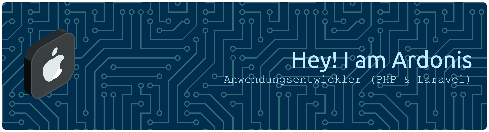

<!-- 

  

 -->

# Hi, I'm Ardonis 👋

💻 Apprentice Software Developer
🚀 Backend Focus (Laravel)
📍 Germany

---

## ⚡ About Me

* 💡 Passionate about backend development
* 🧠 Focused on clean architecture & structured code
* 🚀 Building real-world web applications
* 📈 Constantly improving my skills

---

## 🛠️ Tech Stack

---

## 📫 Contact

* 📧 Email: [ardonisademi9@gmail.com](mailto:ardonisademi9@gmail.com)
* 💼 Instagram: [ardonisademi_dev](https://www.instagram.com/ardonisademi_dev)
* 🌐 Website: [ardonisademi.de](https://ardonisademi.de)

<!--
**zR4Ze/ZR4ZE** is a ✨ _special_ ✨ repository because its `README.md` (this file) appears on your GitHub profile.

Here are some ideas to get you started:

- 🔭 I’m currently working on ...
- 🌱 I’m currently learning ...
- 👯 I’m looking to collaborate on ...
- 🤔 I’m looking for help with ...
- 💬 Ask me about ...
- 📫 How to reach me: ...
- 😄 Pronouns: ...
- ⚡ Fun fact: ...
-->
